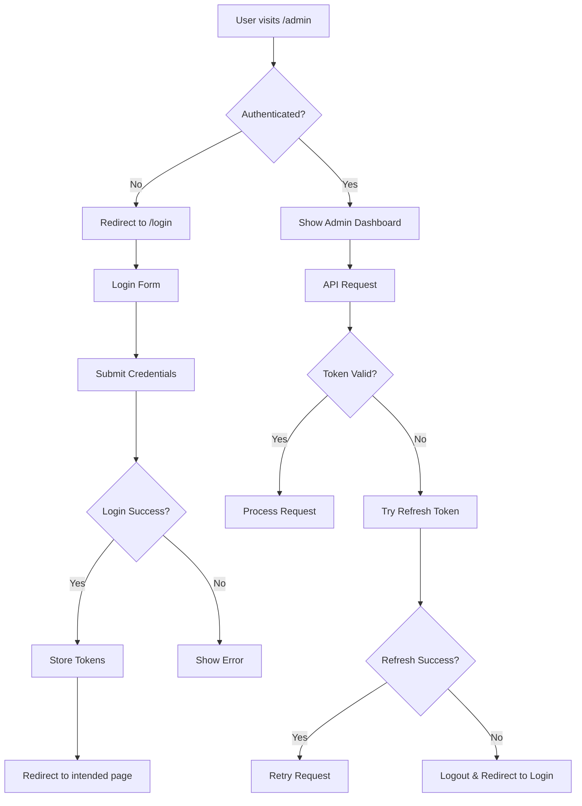

# Authentication System

Hệ thống xác thực hoàn chỉnh cho ứng dụng admin jewelry shop sử dụng React Context, JWT tokens và private routing.

## ✨ Tính năng chính

- 🔐 **JWT Authentication** với access/refresh tokens
- 🛡️ **Private Routes** bảo vệ tất cả admin pages
- 💾 **Persistent Login** lưu trữ trong localStorage
- 🔄 **Auto Token Refresh** khi token hết hạn
- 🚀 **Axios Interceptors** tự động thêm Bearer token
- 📱 **Responsive Design** cho mobile và desktop
- ⚡ **Loading States** và error handling

## 🏗️ Cấu trúc Files

```
src/
├── contexts/
│   └── AuthContext.tsx          # Context và Provider cho authentication
├── components/
│   └── PrivateRoute.tsx        # Component bảo vệ routes
├── pages/
│   └── login/
│       └── page.tsx           # Trang đăng nhập
├── apis/
│   └── auth.api.ts            # API functions cho authentication
├── types/
│   └── auth.type.ts           # Type definitions cho auth
└── layouts/
    ├── header.tsx             # Header với admin info và logout
    └── sidebar.tsx            # Sidebar với admin profile
```

## 🔌 API Integration

### Login Endpoint
```http
POST /api/v1/admins/login
Content-Type: application/json

{
  "usernameOrEmail": "admin01",
  "password": "adminpassword123"
}
```

### Response Format
```json
{
  "success": true,
  "message": "Đăng nhập thành công",
  "data": {
    "admin": {
      "_id": "60d5f484e1a2f5001f647abc",
      "username": "admin01",
      "email": "admin@jewelry-shop.com",
      "role": "Staff",
      "lastLogin": "2024-01-01T00:00:00.000Z",
      "createdAt": "2024-01-01T00:00:00.000Z",
      "updatedAt": "2024-01-01T00:00:00.000Z"
    },
    "accessToken": "eyJhbGciOiJIUzI1NiIsInR5cCI6IkpXVCJ9...",
    "refreshToken": "eyJhbGciOiJIUzI1NiIsInR5cCI6IkpXVCJ9...",
    "expiresIn": 86400
  }
}
```

## 🎯 Usage Examples

### Using AuthContext
```typescript
import { useAuth } from '@/contexts/AuthContext';

const Dashboard = () => {
  const { admin, isAuthenticated, login, logout, isLoading } = useAuth();

  if (isLoading) return <Loading />;

  return (
    <div>
      <h1>Welcome, {admin?.username}!</h1>
      <p>Role: {admin?.role}</p>
      <button onClick={logout}>Logout</button>
    </div>
  );
};
```

### Login Form
```typescript
const LoginPage = () => {
  const { login } = useAuth();

  const handleSubmit = async (data: LoginForm) => {
    try {
      await login(data);
      // Auto redirect to dashboard
    } catch (error) {
      // Error handled by AuthContext
    }
  };
};
```

### Protected Routes
```typescript
// Automatically applied to all admin routes
<PrivateRoute>
  <AdminDashboard />
</PrivateRoute>
```

## 🔒 Security Features

### Token Management
- **Access Token**: Lưu trong localStorage (`admin_access_token`)
- **Refresh Token**: Lưu trong localStorage (`admin_refresh_token`)
- **Admin Data**: Lưu trong localStorage (`admin_data`)
- **Auto Cleanup**: Xóa tất cả khi logout

### Axios Interceptors
```typescript
// Request: Tự động thêm Bearer token
config.headers.Authorization = `Bearer ${accessToken}`;

// Response: Xử lý token expiration
if (status === 401) {
  // Try refresh token
  // Retry original request
  // Logout if refresh fails
}
```

### Route Protection
- Tất cả routes trong `/` được bảo vệ bởi `PrivateRoute`
- Auto redirect đến `/login` nếu chưa authenticated
- Preserve intended URL để redirect sau login

## 🎨 UI Components

### Login Page Features
- ✅ Form validation với Zod
- 🔍 Password visibility toggle
- ⏳ Loading states
- 🚨 Error handling
- 📱 Responsive design
- 🎯 Auto-focus và keyboard navigation

### Header Integration
- 👤 Admin avatar với first letter
- 📧 Display username và email
- 🏷️ Role badge (SuperAdmin/Staff)
- 🚪 One-click logout button
- 🔔 Notification bell

### Sidebar Integration
- 🖼️ Admin profile section
- 📛 Dynamic username display
- 🎭 Role-based styling
- 🎨 Avatar với first letter

## 🔄 Flow Diagram



## 🛠️ Setup Instructions

### 1. Install Dependencies
```bash
npm install @tanstack/react-query react-hook-form @hookform/resolvers zod sonner
```

### 2. Wrap App with Providers
```typescript
// main.tsx
<QueryClientProvider client={queryClient}>
  <AuthProvider>
    <App />
    <Toaster />
  </AuthProvider>
</QueryClientProvider>
```

### 3. Setup Routes
```typescript
// routes.tsx
export const router = createBrowserRouter([
  {
    path: '/login',
    element: <LoginPage />,
  },
  {
    path: '/',
    element: <RootLayout />, // Wrapped with PrivateRoute
    children: [
      // All protected routes
    ],
  },
]);
```

### 4. Configure Axios Base URL
```typescript
// configs/instances/axios.ts
const axiosInstance = axios.create({
  baseURL: 'http://localhost:3000/api/v1',
});
```

## 🎯 Key Benefits

1. **Seamless UX**: Auto login persistence và smooth redirects
2. **Security**: JWT tokens với auto refresh
3. **Type Safety**: Full TypeScript support
4. **Error Handling**: Graceful error recovery
5. **Mobile Ready**: Responsive design
6. **Developer Friendly**: Clean APIs và comprehensive docs

## 🚀 Next Steps

Hệ thống authentication đã sẵn sàng! Bạn có thể:

1. **Test Login**: Sử dụng credentials từ backend
2. **Customize UI**: Thay đổi styling theo brand
3. **Add Features**: Thêm forgot password, profile settings
4. **Extend Security**: Thêm 2FA, session management

## 🔧 Troubleshooting

### Common Issues
- **CORS Error**: Kiểm tra backend CORS settings
- **Token Expiry**: Đảm bảo refresh token endpoint hoạt động
- **Redirect Loop**: Kiểm tra PrivateRoute logic
- **Storage Issues**: Clear localStorage nếu có data cũ

### Debug Tips
```typescript
// Check auth state
console.log('Auth State:', useAuth());

// Check stored tokens
console.log('Tokens:', {
  access: localStorage.getItem('admin_access_token'),
  refresh: localStorage.getItem('admin_refresh_token'),
});
```